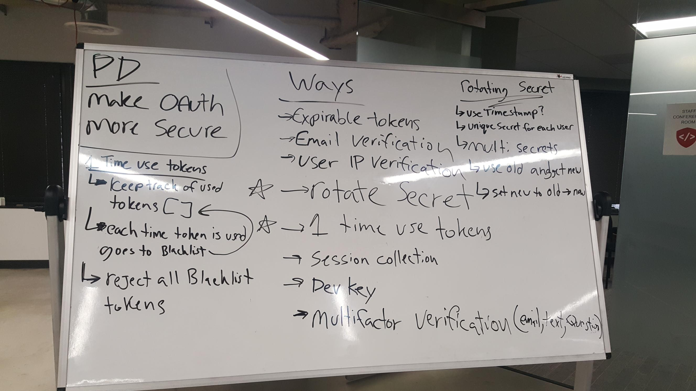

 LAB
=================================================

## Authorization

### Author: Siobhan Niess

### Links and Resources
* [repo](https://github.com/niesssiobhan/18-authorization)
* [travis](https://travis-ci.com/niesssiobhan/18-authorization)
* [server](https://niess-lab-18.herokuapp.com/)

#### Documentation)
* [jsdoc](http://xyz.com)

### Modules
#### `app.js`
#### `google.js`
#### `middleware.js`
#### `router.js`
#### `user-model.js`
#### `index.js`
##### Exported Values and Methods

#### Collaborators
* Brent
* Becca
* Heather
* Jacob
* Caity

### Setup
#### `.env` requirements
* `PORT` - Port Number 8080
* `MONGODB_URI` - MONGODB_URI=mongodb://localhost:27017/lab18

#### Running the app
*
  
#### Tests
* How do you run tests?
npm test
* What assertions were made?
* What assertions need to be / should be made?

#### UML

